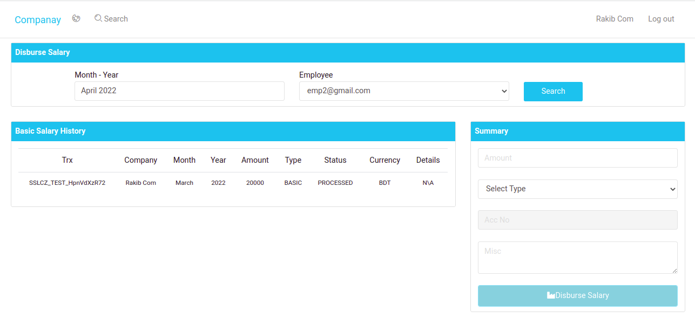

# Application form Employee - Company Management
* ## This is an api based application. React has been used as frontend.
* ## Features
    > Company
    >>
    >> Can Add Employee.
    >>
    >> Can Disburse Salary.
    >>
    >> Can Approve / Decline Leave Request.
    > Employee
    >>
    >> Can Give Attendance (Check In and Check Out)
    >>
    >> Apply for Leave Request.
* ## Some patterns from react whcih has been use in applciation, those are : 
    > Class Component State Management.
    >
    > Lifecycle Methods.
    >
    > Context Api For Login.
    >
    > Forward Refs to Access DOM.
    >
    > Render Props Pattern.
    >
    > Controlled Component.
    >
    > React.memo() and PureComponent for unwanted rendering
    >
    > Functional COmponent Hooks.
    >>
    >> useState.
    >>
    >> useEffect.
    >>
    >> useReducer.
    >>
    >> useContext.

    * ## Some Screenshot from Application
    
    
    
    
    
    
 
